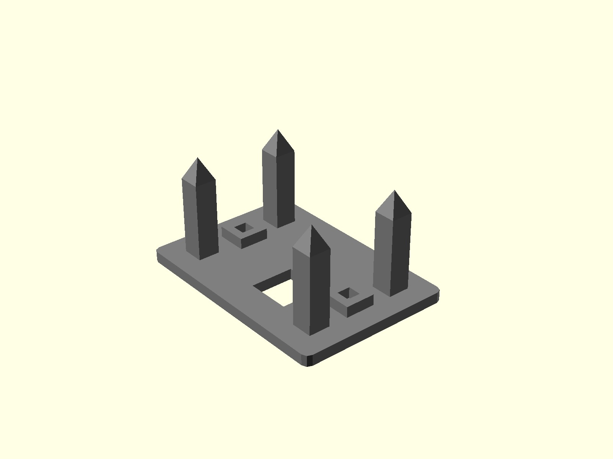
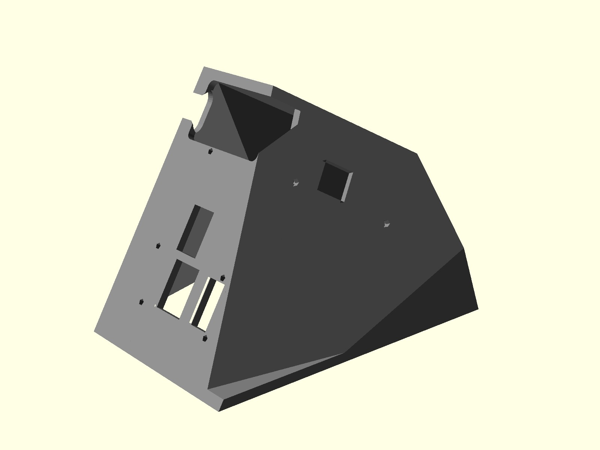
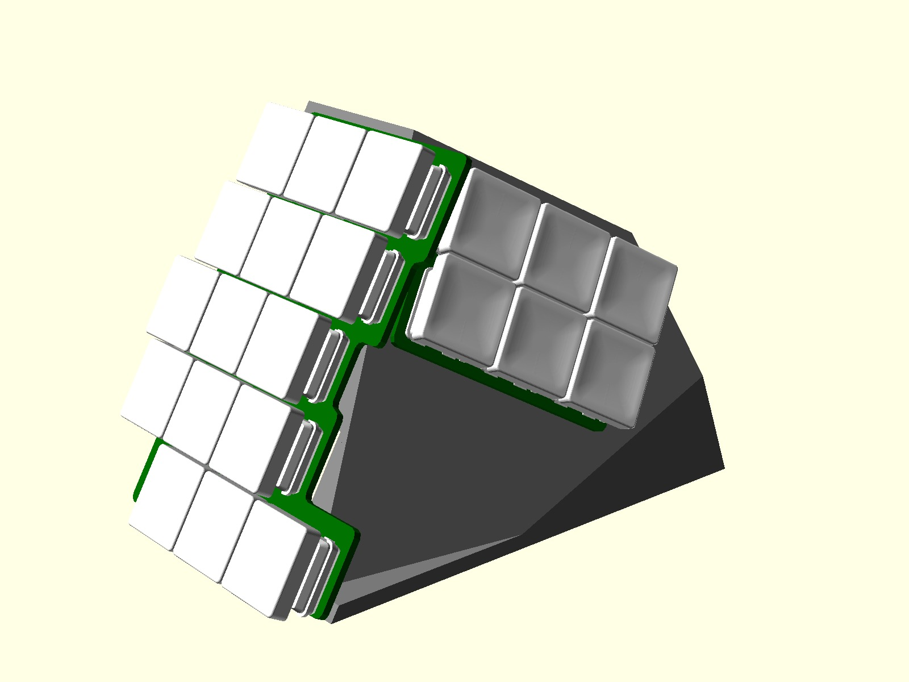
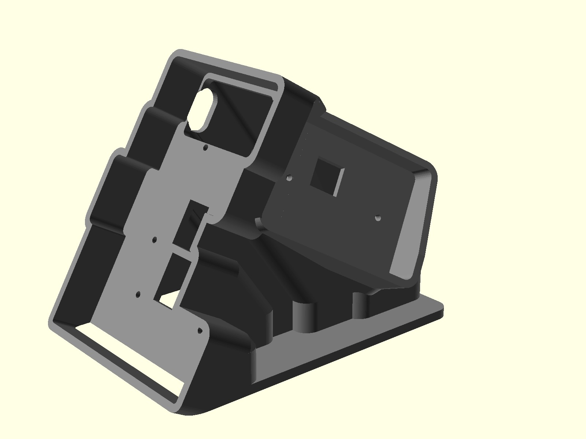
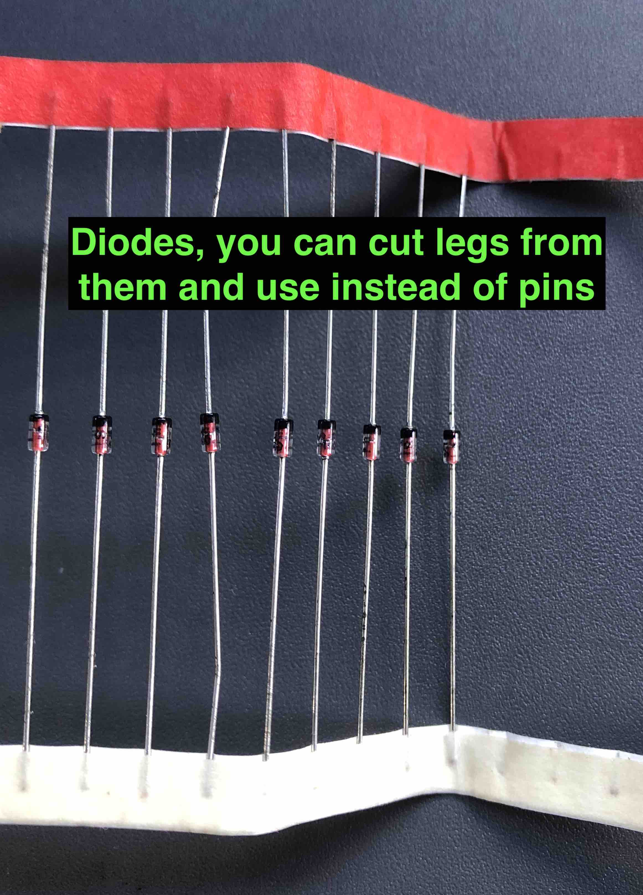

# Flactyl

[](./photos/cases/ice5.jpeg)

## Contacts

If you need help building this keyboard or have any questions you can drop me a line at [yan@yan.my](mailto:yan@yan.my)

I'd be happy to help!

## Release notes

### 5.0

- PCBs v4 are not compatible with case v5, connector cutout location have been changed
- Moved thumb JST connector so that it is not necessary to trim JST cable
- Moved JST connectors, reset button, power switch on main PCBs such that it it easier make parametric case
- Added `.scad` for Iceberg/Clay cases

### 4.2

- First public release

## Features

- Thumb cluster with 6 keys, easy to use in combos, so ~12 combinations depending on how you setup combos
- 15g SPRiT springs to make same finger combos super easy
- Thumb cluster keys are designed to be poked with thumb nail/nose, not pressed with soft area, allows for easy access to all 6 keys with no wrist movement
- Multiple cases including the `clay` case to easily prototype your thumb cluster location
- Low distance between pinky and the table, allows to rest palms directly on the table without floating them, or using wrist rests.
- Heavy tenting at 60 degrees
- Kailh Choc V1 hotswap, with choc spacing
- Rotary encoder
- Ergogen for PCB with some custom scripts to generate `.bom` `.pos` files for jlcpcb.com SMT assembly service, and output outlines for easier 3d case designing
- zmk-config generator with custom NodeJS script to make layer declaration easier and more readable
- Nice!Nano positioned right under the keys, hiding itself, without need for manual wiring (because of that PCBs are non reversible)
- Can fit huge batteries
- Magnetic stripe to securely fasten to the table

## Videos and links

- Youtube video with detailed review is [here](https://www.youtube.com/watch?v=Pdhb9uNnzU0)
- Short typing video [here](https://www.youtube.com/watch?v=eU5eg4PKMlQ)
- Video how to order 3d case from JLCPCB.com [here](https://www.youtube.com/watch?v=07qFKaykjfg)
- Video how to order PCBs from JLCPCB.com [here](https://youtu.be/oP7d0jU99oc)
- Reddit [thread](https://www.reddit.com/r/ErgoMechKeyboards/comments/13qep4y/after_4_year_lurking_and_2_years_building_my_own/)
- You can find [basic](https://github.com/yangit/zmk-config-flactyl/) zmk-config for this board and [my own config generator](https://github.com/yangit/zmk-config/)
- It took me two years to finish this project, thanks to [KBD.news](https://kbd.news/) for inspiration!

## Cases

There are 3 cases available:
**Clay**, **Iceberg**, **Hitam**

### Clay

Consist of two pieces, you are supposed to put clay/play dough in it and see what position is best for you. It is pretty usable already.

[](./photos/cases/clay1.jpeg)
[](./photos/cases/clay2.jpeg)
[](./photos/cases/clay3.jpeg)
[](./photos/cases/clay4.jpeg)

[](./production/case/5.0/clay/case1.jpg)
[](./production/case/5.0/clay/case2.jpg)
[](./production/case/5.0/clay/case3.jpg)
[](./production/case/5.0/clay/case4.jpg)

### Iceberg

Consists of single hollow box, switches are exposed on the sides.

[](./photos/cases/ice1.jpeg)
[](./photos/cases/ice2.jpeg)
[](./photos/cases/ice3.jpeg)
[](./photos/cases/ice4.jpeg)

[](./production/case/5.0/iceberg/variant2/case1.jpg)
[](./production/case/5.0/iceberg/variant2/case2.jpg)
[](./production/case/5.0/iceberg/variant2/case3.jpg)
[](./production/case/5.0/iceberg/variant2/case4.jpg)

### Hitam

Pretty involved shape to cover all the keys from the sides as well.

[](./production/case/5.0/hitam/case1.jpg)
[](./production/case/5.0/hitam/case2.jpg)
[](./production/case/5.0/hitam/case3.jpg)
[](./production/case/5.0/hitam/case4.jpg)

## Customize case

You can customize thumb cluster location reasonably easy using
`./scad/` folder. Try to play around with it, you need OpenScad free software. Look for `./scad/readme.md` for more details.

## Build

High-level build steps looks like so:

- Select which case you want to print
- Order case and PCB from JLCPCB or any other pcb/3d printing vendor
- Order parts online from various vendors according to the parts list
- Solder
  - Pins on the Nice!Nanos themselves see [this](https://docs.splitkb.com/hc/en-us/articles/360011263059-How-do-I-socket-a-microcontroller-) guide
  - Headers for Nice!Nanos on the left and right PCBs
  - Hot-swap connectors for switches on all PCBs
  - Two switches above Nice!Nanos on each side of PCB (letters G,T,J,U on QUERTY)
  - Rotary encoders to PCBs
  - Batteries with connectors (only for wireless build)
- Assemble (do not worry, if you got this far it is only pure joy left)
  - Small tip, when screwing everything, you should use 2 nuts per screw, it goes like so
  - SCREW, WASHER, PCB, **NUT**, CASE, NUT. Notice the extra nut, it helps tremendously to fiddle all the screws through the case at the same time. See [here](./photos/parts/nut_how.jpg)
  - The JST connector will not fit into the thumb cluster side, that is fine, just trim it with a knife
- Flash it with ZMK firmware (or any other you want)
  - Spend months in agony migrating Querty => Workman => Colemak, moving around symbols, modifiers, and learning the intricate issues of how TAP-DANCE timings are implemented.
- Enjoy?
  - Enjoy!

Look up `Videos` section of this readme to see how to order PCBs and 3d files from JLCPCB.com

This is how PCB should come out from JLCPCB.com, complete with all diodes, JST connectors, power switch, reset button(not visible)

[](./photos/parts/assembly.jpeg)

## Parts list

You are going to need some items to get done:

|  Count   | Name   | Photo   |
|-------------|-------------|-------------|
| 2 | EC11 Rotary encoder with a knob (ALP-ENC-TCT-001 or any similar will do), if you do not want to have a rotary encoder, you can just solder a normal switch in its place. It will work.| [](./photos/parts/encoder.webp)
| 42 | Kailh Low Profile Choc V1 PG1350 switches (highly recommend getting 20g (pink) for thumb cluster to make multi key combos easier)|  [](./photos/parts/pink.webp)
| 42 | 1u Blank MBK Choc Low Profile Keycaps| [](./photos/parts/mbk.png)
| 2 | Pitch 2.54mm 1 * 40 Pin Sets of headers/sockets for Nice!Nanos| [](./photos/parts/header.jpg)
| 2 | Nice!Nano micro controllers| [](./photos/parts/nicenano-v2.avif)
| 2 | Mill Max 3320 Pins for Nice!Nano micro controllers, they are soldered to your Nice!Nanos, and that allows you to plug nice nano into headers, buy default Nice!Nanos come with square pins not suitable for socketing (see photos), the default ones can only be used to permanently solder controller onto the PCB **which should be avoided**. If the pins are expensive or unavailable you can buy any through hole diodes and cut their legs to use instead, though legs are thinner and are slightly harder to work with, see [this](https://docs.splitkb.com/hc/en-us/articles/360011263059-How-do-I-socket-a-microcontroller-) guide| [](./photos/parts/pins.jpg) [](./photos/parts/pins2.jpg) [](./photos/parts/pins3.jpg) [](./photos/parts/pins4.jpg)
| 32 | Hot swap connectors for PG1350 | [](./photos/parts/hotswap.webp)
| 2 | Case|
| 4 | Pcb (one for each half and two for thumb clusters)| [](./photos/parts/pcb.jpeg) [](./photos/parts/thumb.jpg)
| 12 | M2 x 10mm Screws (I recommend getting hex head screws, they are easier to tighten)| [](./photos/parts/nuts.jpeg)
| 12 | M2x3x3x1.8 square (!NOT regular hex!) nuts, see photo|[](./photos/parts/nut.jpeg)
| 12 | Spring washers |[](./photos/parts/washers.jpeg)
| 2 | JST SH 1.0mm x 2 wires x 100mm long wire connector for battery (only if you want to go wireless)| [](./photos/parts/battc.jpeg)
| 2 | Battery, any single cell Li-ion/Li-po 100-1000mah will do, connector does not matter, you going to resolder it anyway  (only if you want to go wireless)| [](./photos/parts/batt.jpeg)
| 2 | JST SH 1.0mm x 5 wire x 100mm long cable for thumb cluster (carefully look at the cable colors, there are two types of connector with  cross over and direct, you need connector with the same color order on both sides ), second photo shows how you will need to trim the connector using utility knife to make sure it fits into the pcb|[](./photos/parts/conn.jpeg) [](./photos/parts/trim.jpeg)
| 8 | 8mm silicone rubber feet (self adhesive)| [](./photos/parts/feet.webp)
| 1 | Roll of 3m magnetic strip 1inch wide (25.4mm) for the undercase holder. Unless your table is metal you need to glue the other part of the tape on the table as well like on the photo => | [](./photos/parts/mag1.jpeg) [](./photos/parts/mag2.jpeg) [](./photos/parts/mag3.jpeg)
|2|USB-C cables of your preference, one will connect your main half and computer to communicate keypresses and provide power, another between your driven half and any power source, to provide power only. You may not need 2 cables and get away with one USB-C cable if you intend to use battery, also 2 cables are handy when you need to re-flash your controllers with new firmware|[](./photos/parts/usbc.jpg)

You will also need

- Screw driver
- Soldering iron with flux and solder
- Knife to trim JST connectors for thumb cluster

## ZMK-config

You can take a basic config for this shield [here](https://github.com/yangit/zmk-config-flactyl/)

## Structure of this repo

### `./production`

You can grab `.zip` and `.stl` here, and send them to JLCPCB.com, they will print case, and PCB, it also includes BOM and POS files so that JLCPCB can solder connectors, diodes, reset button and power switch on the board for you.

Look up `Videos` section of this readme to see how to order PCBs and 3d files from JLCPCB.com

### `./ergogen`

YOU DO NOT NEED THIS

unless you want to mess with my PCB generation code, you can just grab readymade pcb from `./production/`
Modified fork of [ergogen](https://github.com/ergogen/ergogen) now can be found [here](https://github.com/yangit/ergogen)

This folder will appear to be empty if you try to `git clone` or download a zip archive, you just need to run

```bash
git clone https://github.com/yangit/flactyl
cd ./flactyl
git submodule init
git submodule update
```

Now your `./ergogen` should contain latest code.
Alternatively you can proceed to [here](https://github.com/yangit/ergogen) to find contents of `./ergogen` folder.

To build it make sure you have npm/nodejs installed:

```bash
cd ./ergogen
npm install
./input/bulid.sh
```

This will produce files in the `./ergogen/output` folder.
Now you need to prepare them for JLCPCB, you HAVE to follow requirements in `./ergogen/input/readme.md`, notice that it is in subfolder `./input` and not the root level `readme.md`

 and they can be used for JLCPCB.com printing, that includes `.pos` and `.bom` files for SMT assembly.
If you are looking to make any changes, go under `./ergogen/input` folder and change config files there.

## Photos

[](./photos/cases/ice1.jpeg)
[](./photos/cases/ice2.jpeg)
[](./photos/cases/ice3.jpeg)
[](./photos/cases/ice4.jpeg)
[](./photos/cases/ice5.jpeg)
[](./photos/cases/ice6.jpeg)
[](./photos/cases/ice7.jpeg)
[](./photos/cases/ice8.jpeg)

## What I have learned

### 3d printing materials (From JLCPCB.com)

- ABS plastic, the surface finish is not there. It should be painted or it is too rough. I do not like the resolution of the ABS FDM
- SLA (resin) `LEDO 6060`: the plastic is very nice, white, finish is great, but it will [yellow significantly](./photos/parts/yellowing.jpg) if you expose it to the sunlight, my keyboard looks like that after 2 months on my desk and some direct summer sun. Notice how the inside did not yellow.
- SLA (resin) `Black Resin`: it is very dark grey, satin, finish is very smooth, I like it.

### 3d design

If you are a programmer:

Do not try to design anything in Fusion 360, it is way too easy, visual, and you have so many tools at your disposal. Until one day you need to refactor your model and add a minor change somewhere in the past.
Screw Fusion 360! It will mess up your model in this case no matter how hard you try to make your model parametric and no matter how careful you are taking care of your history.

GIT + OpenScad is 100% more predictable, you might need to write your own helpers, but it was 10 times faster than fiddling with Fusion 360.

### Config generator

Also you will most likely need your own ZMK/QMK config generator. Basic layers, are ok to write by hand, but tap dances are just horrible in both ZMK and QMK, my config generator of ~500 lines in JavaScript generates `.keymap`  ~5000 lines long. How am I supposed to maintain it manually? Features I have in my generator are:

- mirror layer
- create layer from another, but with modifier
- easily define macros, tap-dance etc
- fix tap-dance timing mess

You can take a look at my config generator [here](https://github.com/yangit/zmk-config/)

### Mirror layers

I use split in programs like Photoshop and Fusion 360. One of the problems I had is when you need to press single hotkey i.e. letter “L” which is on the right side. Moving my hand from the mouse for that single press is simply annoying.

So I had these solutions:

#### Fusion 360 layer

I would enable it when I navigate to fusion and all most common keys would be on the left hand. I.e. I would put “L” under right index. That allows me to comfortably use any program and all wired shortcuts like “CMD+CTRL+X+P+F2+NUM14” BUT! If I need to switch back and forth between fusion and gmail, or if I need to label objects in my model (type short stings of text) it becomes a pain to switch to/from the layer unless it is a momentary layer. Overall it is a very quick/easy solution, and if you have stable workflow(know your hotkeys) and there are not too many programs(and so layers) you can get away with it.

#### Mirror layer

On my left half i have a “mirror” layer which swaps all the letters from the right half. Using that magic button I can all of a sudden type any key any time with one hand. So great! Gmail hotkeys, chrome, photoshop, fusion all of them work w/o custom layers and on one hand.
BUT then you realize that you not only need letter L but also CMD+L or SHIFT+CMD+L and that is still manageable by using “tap dance” Essentially short tap emits “L”, hold emits “CMD+L” and tap and hold emits “CMD+SHIFT+L” Ok good? Not yet, there are more than letters you want to mirror, sometimes you need to type single “!” Or just press that “up” key once, or else. So I ended up using 3 mirror layers.

- letters
- symbols
- arrows (it also has stuff like PageUp etc)

Then there is an issue. You need to be able to activate all 8 layers from one hand:

- letters
- mirror letters
- symbols
- mirror symbols
- arrows
- mirror arrows
- shift layer
- mirror shift layer

Ok, we need to talk here. Lets drop the last two, that brings number to 6. The first one(letters) you do not need to activate it is already active. Now you need to increase number of layers you can comfortably activate on the left hand. One approach is to press thumb on two keys simultaneously. If your thumb cluster looks like so {a, b, c} you can press “a”, “b”, “c“ but also “ab” and “bc”. You have got 5 layers instead of 3. That depends on your thumb cluster and that is why I do not like splay(rotation) on thumb keys. I like them aligned next to each other like on [moonlander](https://www.zsa.io/moonlander/) keyboard. Having easy 20g spring under thumb keys helps a lot with pressing two keys simultaneously.

#### Integrate mouse into keyboard

I’m still on the way to this solution, but if you get like [Charybdis](https://bastardkb.com/charybdis/) you may be happy since your hands are not leaving keyboard at all.

## Mods

- If 20g pink Choc are unavailable you can do 15g SPRiT springs mod, it is tedious, but worth it if all you got is 40g linear.
- Ball bearing mod: somehow ball bearing mod did not work as well on Kailh Choc as it did on Kailh Box, so I can not recommend it to reduce travel, I was able to add balls, but the slightly reduced travel immediately affected the consistency and I had to type harder or twice to get key to fire.

## License

MIT
