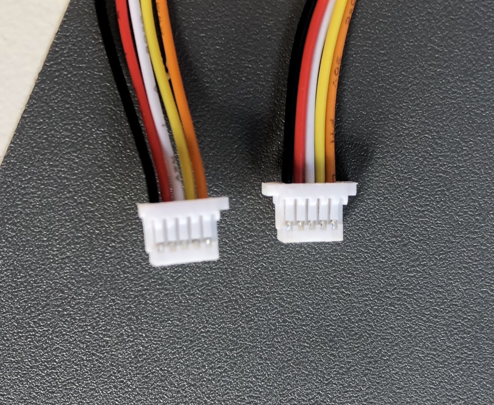
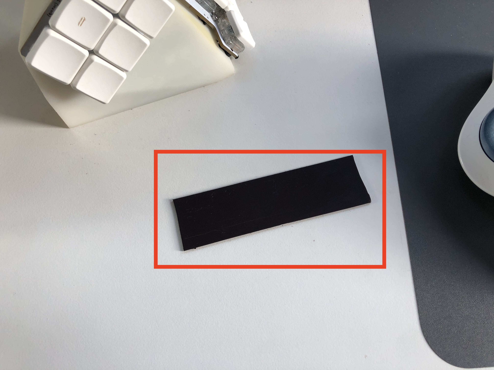

# Flactyl

## Contacts

If you need help building this keyboard or have any questions you can drop me a line at [yan@yan.my](mailto:yan@yan.my)

I'd be happy to help!

## Features

- Thumb cluster with 6 keys, easy to use in combos, so ~12 combinations depending on how you setup combos
- 15g SPRiT springs to make same finger combos super easy
- Thumb cluster keys are designed to be poked with thumb nail/nose, not pressed with soft area, allows for easy access to all 6 keys with no wrist movement
- Multiple cases including the `clay` case to easily prototype your thumb cluster location
- Low distance between pinky and the table, allows to rest palms directly on the table without floating them, or using wrist rests.
- Heavy tenting at 60 degrees
- Choc hotswap
- Rotary encoder
- Ergogen for PCB with some custom scripts to generate `.bom` `.pos` files for jlcpcb.com SMT assembly service, and output outlines for easier 3d case designing
- zmk with custom nodejs script to make layer declaration easier and more readable
- Nice!Nano positioned right under the keys, hiding itself, without need for manual wiring (because of that PCBs are non reversible)
- Can fit huge batteries
- Magnetic stripe to securely fasten to the table
- The tentable table seen on the photos is from HumanScale

## Videos and links

- Youtube video with detailed review is [here](https://www.youtube.com/watch?v=Pdhb9uNnzU0)
- Short typing video [here](https://www.youtube.com/watch?v=eU5eg4PKMlQ)
- Video how to order 3d case from JLCPCB.com [here](https://www.youtube.com/watch?v=07qFKaykjfg)
- Video how to order PCBs from JLCPCB.com [here](https://youtu.be/oP7d0jU99oc)
- Reddit [thread](https://www.reddit.com/r/ErgoMechKeyboards/comments/13qep4y/after_4_year_lurking_and_2_years_building_my_own/)
- You can find zmk-config for this board [here](https://github.com/yangit/zmk-config/)
- It took me two years to finish this project, thanks to [KBD.news](https://kbd.news/) for inspiration!

## Cases

There are 3 cases available:
**Clay**, **Iceberg**, **Hitam**.

### Clay

Consist of two pieces, you are supposed to put clay/play dough in it and see what position is best for you. It is pretty usable already.

[](./photos/cases/clay1.jpeg)
[](./photos/cases/clay2.jpeg)
[](./photos/cases/clay3.jpeg)
[](./photos/cases/clay4.jpeg)

[](./photos/cases/clay6.png)
[](./photos/cases/clay8.png)
[](./photos/cases/clay9.png)
[](./photos/cases/clay10.png)

### Iceberg

Consists of single hollow box, switches are exposed on the sides.

[](./photos/1.jpeg)
[](./photos/6.jpeg)
[](./photos/8.jpeg)
[](./photos/10.jpeg)

[](./photos/cases/ice1.png)
[](./photos/cases/ice2.png)
[](./photos/cases/ice3.png)
[](./photos/cases/ice4.png)

### Hitam

(COMING SOON) pretty involved shape to cover all the keys from the sides as well.

[](./photos/cases/hitam1.png)
[](./photos/cases/hitam2.png)

Look up `Videos` section of this readme to see how to order PCBs and 3d files from JLCPCB.com

## Customize case

You can customize thumb cluster location reasonably easy using
`./scad/` folder. Try to play around with it, you need OpenScad free software. Look for `./scad/hitam/develop.scad` file.
And if you want to render for export you can use `export_left.scad` and `export_right.scad` respectively

## Build

High-level build steps looks like so:

- Select which case you want to print
- Order case and PCB from JLCPCB or any other pcb/3d printing vendor
- Order parts online from various vendors according to the parts list
- Solder everything up
- Assemble everything down
- Flash it with ZMK firmware (or any other you want)

Look up `Videos` section of this readme to see how to order PCBs and 3d files from JLCPCB.com

This is how PCB should come out from JLCPCB.com, complete with all diodes, JST connectors, power switch, reset button(not visible)

[](./photos/parts/assembly.jpeg)

## Parts list

You going to need some assorment of items to get done:

|  Count   | Name   | Photo   |
|-------------|-------------|-------------|
| 2 | EC11 Rotary encoder with a knob (ALP-ENC-TCT-001 or any similar will do)| [](./photos/parts/encoder.webp)
| 42 | Kailh Low Profile Choc switches (highly recommend getting 20g (pink) for thumb cluster to make multi key combos easier)|  [](./photos/parts/pink.webp)
| 42 | 1u Blank MBK Choc Low Profile Keycaps| [](./photos/parts/mbk.png)
| 2 | Pitch 2.54mm 1 * 40 Pin Sets of headers for Nice!Nanos| [](./photos/parts/header.jpg)
| 2 | Nice!Nano microcontrollers| [](./photos/parts/nicenano-v2.avif)
| 32 | Hot swap connectors (two buttons are soldered directly on each half)| [](./photos/parts/hotswap.webp)
| 2 | Case| 
| 4 | Pcb (two for each half and two for thumb clusters)| [](./photos/parts/pcb.jpeg)
| 12 | M2 x 10mm Screws (I recommend getting hex head screws, they are easier to tighten)| [](./photos/parts/nuts.jpeg)
| 12 | M2x3x3x1.8 square (!NOT regular hex!) nuts, see photo| 
| 12 | Spring washers |
| 2 | JST SH 1.0mm x 2 wire connector for battery (only if you want to go wireless)| [](./photos/parts/battc.jpeg)
| 2 | Battery, any single cell Li-ion/Li-po 100-1000mah will do, connector does not matter, you going to resolder it anyway  (only if you want to go wireless)| [](./photos/parts/batt.jpeg)
| 2 | JST SH 1.0mm x 5 wire cable for thumb cluster (carefully look at the cable colors, there are two types of connector with  cross over and direct, you need connector with the same color order on both sides ), second photo shows how you will need to trim the connector using utility knife to make sure it fits into the pcb|[](./photos/parts/conn.jpeg) [](./photos/parts/trim.jpeg)
| 8 | 8mm silicone rubber feet (self adhesive)| [](./photos/parts/feet.webp)
| 1 | Roll of 3m magnetic strip 1inch wide (25.4mm) for the undercase holder. Unless your table is metal you need to glue the other part of the tape on the table as well like on the photo => | [](./photos/parts/mag1.jpeg) [](./photos/parts/mag2.jpeg) [](./photos/parts/mag3.jpeg)

You will also need

- Screw driver
- Soldering iron with flux and solder
- Knife to trim JST connectors for thumb cluster

## ZMK-config

You can take a basic config for this shield [here](https://github.com/yangit/zmk-config-flactyl/)

## Structure of this repo

### `./production`

You can grab `.zip` and `.stl` here, and send them to JLCPCB.com, they will print case, and PCB, it also includes BOM and POS files so that JLCPCB can solder connectors, diodes, reset button and power switch on the board for you.

Look up `Videos` section of this readme to see how to order PCBs and 3d files from JLCPCB.com

### `./ergogen`

YOU DO NOT NEED THIS

unless you want to mess with my PCB generation code, you can just grab readymade pcb from `./production/`
Modified fork of [ergogen](https://github.com/ergogen/ergogen) now can be found [here](https://github.com/yangit/ergogen)

This folder will appear to be empty if you try to `git clone` or download a zip archive, you just need to run

```bash
git clone https://github.com/yangit/flactyl
cd ./flactyl
git submodule init
git submodule update
```

Now your `./ergogen` should contain latest code.
Alternatively you can proceed to [here](https://github.com/yangit/ergogen) to find contents of `./ergogen` folder.

To build it make sure you have npm/nodejs installed:

```bash
cd ./ergogen
npm install
./input/bulid.sh
```

This will produce files in the `./ergogen/output` folder.
Now you need to prepare them for JLCPCB, you HAVE to follow requirements in `./ergogen`

 and they can be used for JLCPCB.com printing, that includes `.pos` and `.bom` files for SMT assembly.
If you are looking to make any changes, go under `./ergogen/input` folder and change config files there.

## Photos

[](./photos/1.jpeg)
[](./photos/6.jpeg)
[](./photos/7.jpeg)
[](./photos/8.jpeg)
[](./photos/9.jpeg)
[](./photos/10.jpeg)
[](./photos/11.jpeg)
[](./photos/12.jpeg)
[](./photos/4.jpeg)

## License

MIT
